# python-api-assignment

## To start assignment we need some software:

  * Install some softwares and dependencies:
    ```
    pip3 install -r requirements.txt
    ```

  * Install PostgresSQL and run it:
    ```
    apt-get install postgresql
    pg_ctl -D /usr/local/var/postgres start
    ```

  * Please remember create PostgresSQL `username=postgres` and `password=postgres`.

## Customers data model

1. Create table customers using SqlAlchemy, please read [customer_data.py](https://github.com/bxdoan/python-api-assignment/blob/master/customer_data_model/customer_data.py):
    ```
    python /customer_data_model/customer_data.py
    ```
    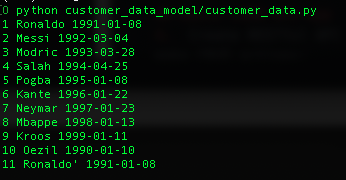

2. A query in PostgresSQL syntax to get names of the youngest customers:
  [youngest_customers.sql](https://github.com/bxdoan/python-api-assignment/blob/master/customer_data_model/youngest_customers.sql) - sql query
  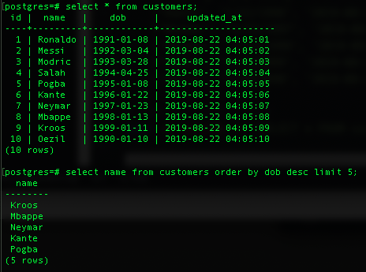
3.  Write a shell script, preferred as .sh bash script as [db-seed.sh](github.com/bxdoan/python-api-assignment/blob/master/customer_data_model/db-seed.sh), that will a) drop the database if exist, b) create the database, c) create the :customers table, d) insert some seeding data. Use command below to see the result:
    ```
    chmod +x customer_data_model/db_seed.sh && ./customer_data_model/db_seed.sh
    ```
    

## Basic JSON API App
4.  Create RESTful API endpoints returning JSON so that we can make CRUD actions:
    Please see [run.py](github.com/bxdoan/python-api-assignment/blob/master/basic_json_api/run.py) and run command to run the server locally:
    ```
    cd basic_json_api/
    FLASK_APP=run.py FLASK_DEBUG=1 flask run
    ```
    * Read: `method = GET`

      [api.bxdoan.com/customers](http://api.bxdoan.com/customers) - show all customers
      ```
      [{'id': id
       'name': name,
       'dob': dob
       'updated_at': updated_at},....]
      ```
      [api.bxdoan.com/customers/id](http://api.bxdoan.com/customers/1) - show **only** 1 customer by **id**
      ```
      {'id': id
       'name': name,
       'dob': dob
       'updated_at': updated_at}
      ```
    * Create: `method = POST`

      [api.bxdoan.com/customers](http://api.bxdoan.com/customers) - create customer with data json type:
      ```
      {'name': name,
       'dob': dob}
      ```
    * Update: `method = PUT`

      [api.bxdoan.com/customers](http://api.bxdoan.com/customers) - update **only** 1 customer by **id** `id=<id>` in json type:
      ```
      {'id': id
       'name': name,
       'dob': dob}
      ```
    * Delete: `method = DELETE`

      [api.bxdoan.com/delete?id=1](http://api.bxdoan.com/customers) - delete **only** 1 customer by **id** `id=<id>` in json type
      ```
      {'id': id}
      ```
5.  Share [postman_collection.json](https://github.com/bxdoan/python-api-assignment/blob/master/postman_collection.json) where we can use to make calls to these endpoints.
    Remember import [bxdoan_postman_environment.json](https://github.com/bxdoan/python-api-assignment/blob/master/bxdoan_postman_environment.json) and [localhost_postman_environment.json](https://github.com/bxdoan/python-api-assignment/blob/master/localhost_postman_environment.json) to test

## Deployment and Auth
6.  Deploy on Google Cloud Platform with domain [api.bxdoan.com](http://api.bxdoan.com/) or IP **35.198.220.248**

7.  The POST endpoint only allow to create user with age greater than 18.
    * Registration: `method = POST`

    [api.bxdoan.com/registration](http://api.bxdoan.com/registration) - with data json type:
    ```
    {'username': username,
     'password': password,
     'dob': dob}
    ```
    **Create** with age lower than 18 with receive
    ```
    {'message': 'User should be greater 18'}
    ```

8.  Authentication should be using JWT token.
    * Registration: `method = POST`

    [api.bxdoan.com/registration](http://api.bxdoan.com/registration) - with data json type and `Content-Type=aplication/json` in header:
    ```
    {'username': username,
     'password': password,
     'dob': dob}
    ```
    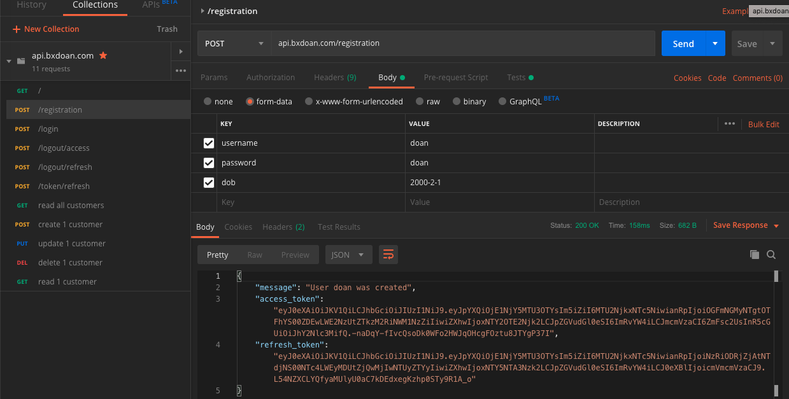
    * Login: `method = POST`

    [api.bxdoan.com/login](http://api.bxdoan.com/login) - with data json type and `Content-Type=aplication/json` in header:
    ```
    {'username': username,
     'password': password}
    ```
    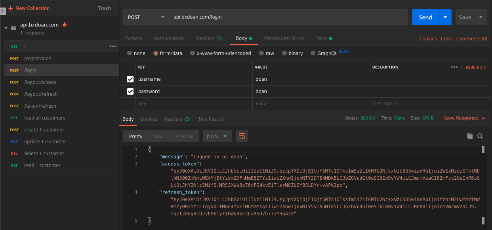

    * After **login** or **registration**, we continuous use `/customers` api with `Authentication= 'Bearer <access_token>'` in header to create/read/update/delete customers:

    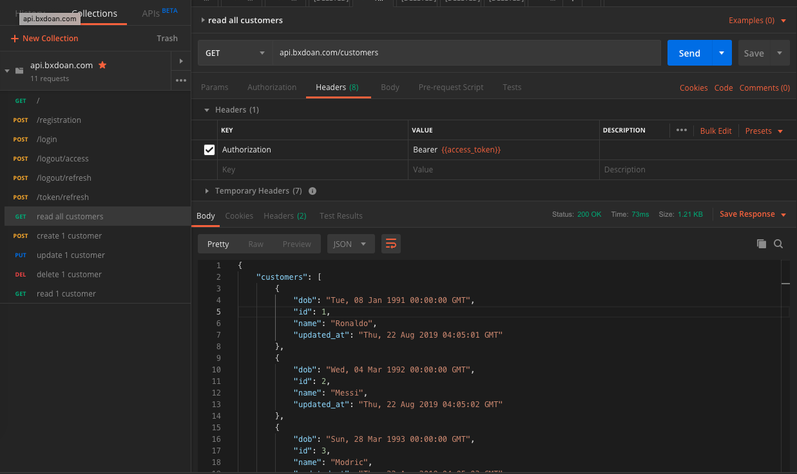
    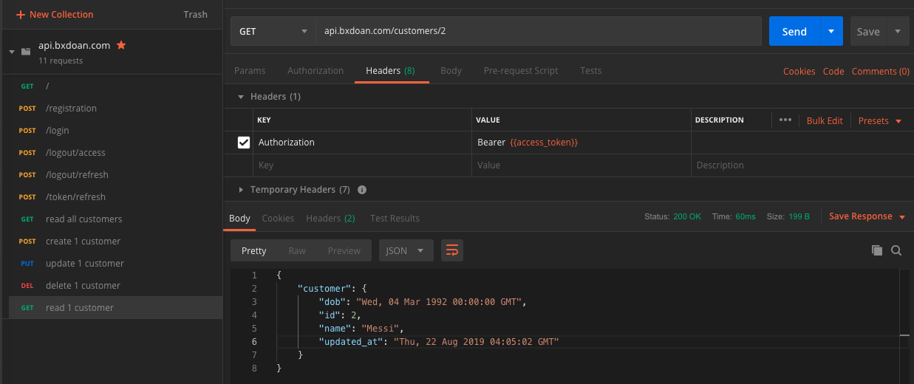
    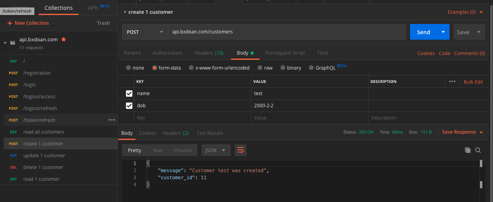
    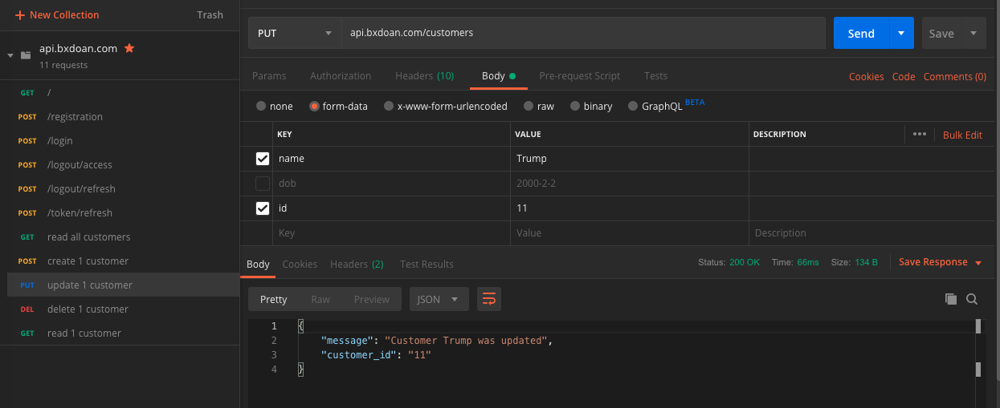
    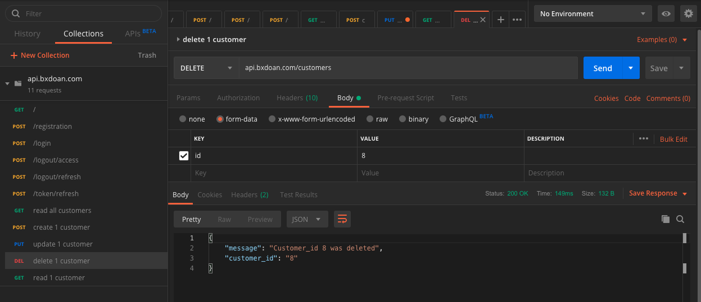

    * Logout access_token: `method = POST`

    [api.bxdoan.com/logout/access](http://api.bxdoan.com/logout/access) - with `Authentication= 'Bearer <access_token>'` in header:
    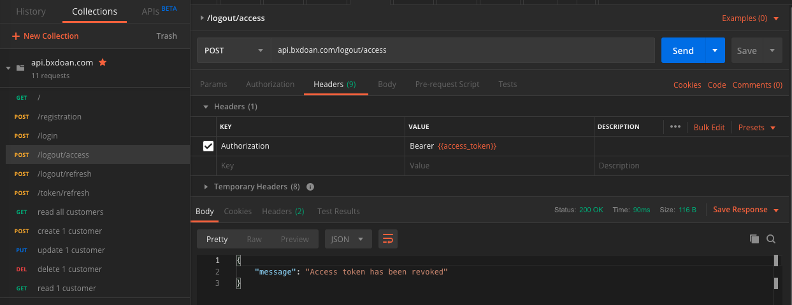
    * Logout refresh_token: `method = POST`

    [api.bxdoan.com/logout/refresh](http://api.bxdoan.com/logout/refresh) - with `Authentication= 'Bearer <refresh_token>'` in header:
    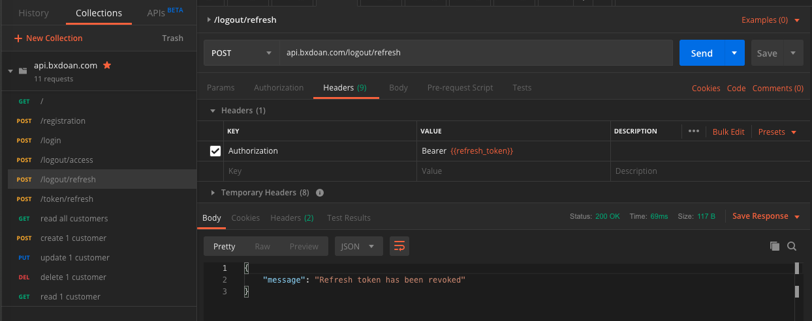
    **Note:** After logout refresh token, we need login again
    * Token refresh: `method = POST`

    [api.bxdoan.com/token/refresh](http://api.bxdoan.com/token/refresh) - with  `Authentication= 'Bearer <refresh_token>'` in header.
    The access_token will expire in 15 minutes, so we need to refresh token by using this api and **refresh_token**
    The refresh_token will also expire in 1 hour.
    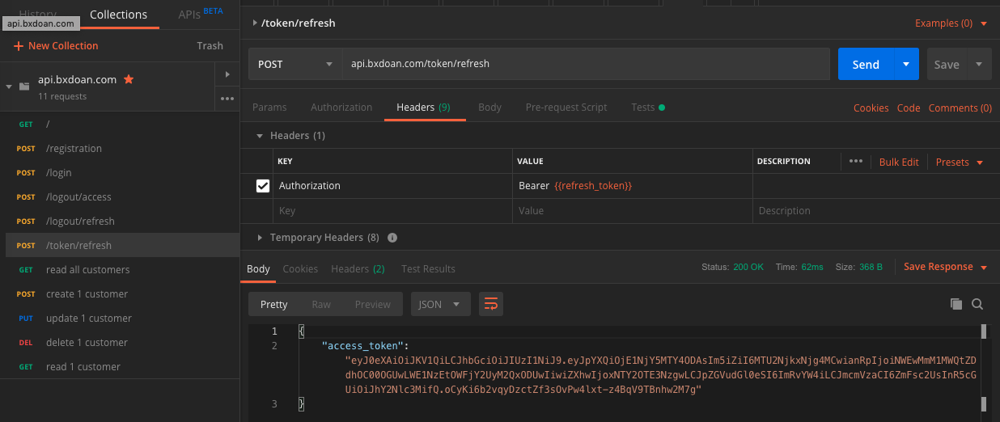

## devops

1. Install Compute Engine with VM instance details:
  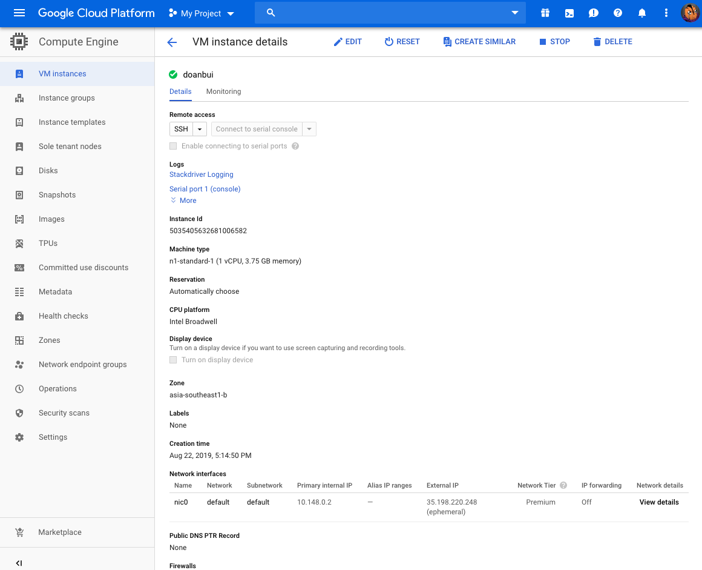

2. Configuration dns domain for server:
  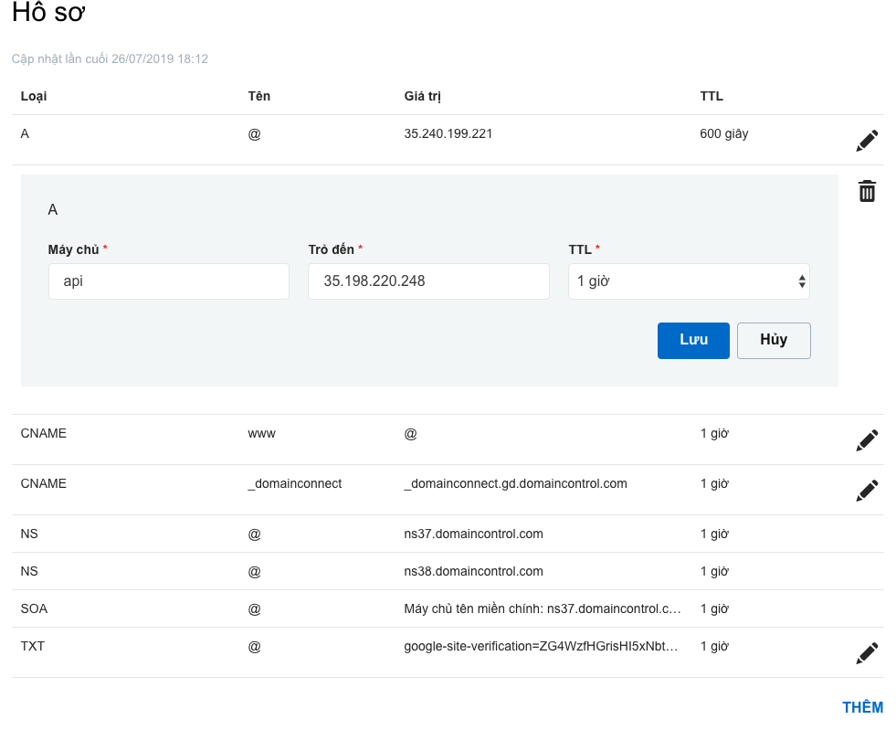

3. Configuration wsgi:

  Create a file /python-api-assignment/basic_json_api/run.ini:
  ```
  [uwsgi]
  module = run:app
  master = true
  processes = 2
  socket = bxdoan.sock
  chmod-socket = 660
  vacuum = true
  callable = app
  buffer-size = 32768
  die-on-term = true
  logger = file:/tmp/errlog
  ```
  Then create a systemctl startup file /etc/systemd/system/bxdoan.service:
  ```
  [Unit]
  Description="uWSGI server instance for bxdoan.com"
  After=network.target

  [Service]
  User=www-data
  Group=www-data
  WorkingDirectory=/var/www/html/python-api-assignment/basic_json_api/
  ExecStart=uwsgi --ini /var/www/html/python-api-assignment/basic_json_api/run.ini

  [Install]
  WantedBy=multi-user.target
  ```
  Start process:
  ```
  sudo systemctl start bxdoan
  sudo systemctl enable bxdoan
  ```
  Check socket file:
  ```
  ls /var/www/html/python-api-assignment/basic_json_api/bxdoan.sock
  ```
  If you see **bxdoan.sock**, it means that wsgi is ready to connect, but we need to continue configure engix to forward port default 80 to socket that we've created.

4. Configuration Nginx:

  Create a file /etc/nginx/sites-enabled/bxdoan.nginx:
  ```
  server {
      listen 80;
      server_name api.bxdoan.com www.api.bxdoan.com;

      location / {
          include uwsgi_params;
          uwsgi_pass unix:/var/www/html/python-api-assignment/basic_json_api/bxdoan.sock;
      }
  }
  ```
  Test your Nginx configuration and start Nginx:
  ```
  nginx -t -c /etc/nginx/nginx.conf
  # nginx: the configuration file /etc/nginx/nginx.conf syntax is ok
  # nginx: configuration file /etc/nginx/nginx.conf test is successful

  /etc/init.d/nginx start
  ```
