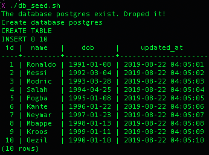

# python-api-assignment

## To start assignment we need some software:

  * Install pyenv `brew install pyenv` in MacOS or `sudo apt-get install pyenv` in Ubuntu/other Linux distro.
  * Install Python version 3.6.8 using pyenv:
    ```
    pyenv install 3.6.8
    pyenv global 3.6.8
    ```
  * Install sqlalchemy and dependencies:
    ```
    pip install sqlalchemy
    pip install psycopg2-binary
    ```
  * Install Flask and dependencies:
    ```
    pip3 install flask flask-jsonpify flask-sqlalchemy flask-restful
    ```
  * Install PostgresSQL and run it:
    ```
    brew install postgresql
    pg_ctl -D /usr/local/var/postgres start
    ```

  * Please remember create PostgresSQL `username=postgres` and `password=postgres`.

## Customers data model

1. Create table customers using SqlAlchemy, please read [customer_data.py](https://github.com/bxdoan/python-api-assignment/blob/master/customer_data_model/customer_data.py):
    ```
    python /customer_data_model/customer_data.py
    ```
    

2. A query in PostgresSQL syntax to get names of the youngest customers:
  [youngest_customers.sql](https://github.com/bxdoan/python-api-assignment/blob/master/customer_data_model/youngest_customers.sql) - sql query
  
3.  Write a shell script, preferred as .sh bash script as [db-seed.sh](github.com/bxdoan/python-api-assignment/blob/master/customer_data_model/db-seed.sh), that will a) drop the database if exist, b) create the database, c) create the :customers table, d) insert some seeding data. Use command below to see the result:
    ```
    chmod +x customer_data_model/db_seed.sh && ./customer_data_model/db_seed.sh
    ```
    

## Basic JSON API App
4.  Create RESTful API endpoints returning JSON so that we can make CRUD actions:
    Please see [server.py](github.com/bxdoan/python-api-assignment/blob/master/basic_json_api/server.py) and run command to run the server locally:
    ```
    python basic_json_api/server.py
    ```
    * Read: `method = GET`
      api.bxdoan.com/customers
      [api.bxdoan.com/customers](api.bxdoan.com/customers) - show all customers
      [api.bxdoan.com/customers/<id>](api.bxdoan.com/customers/1) - show **only** 1 customer by **id**
    * Create: `method = POST`
      [api.bxdoan.com/create](api.bxdoan.com/create) - create customer with pair `name=<name>` and `dob=<datetime>`
    * Update: `method = POST`
      [api.bxdoan.com/update](api.bxdoan.com/update) - update **only** 1 customer by **id** `id=<id>` with `name=<name>` or `dob=<datetime>`
    * Delete: `method = DELETE`
      [api.bxdoan.com/delete](api.bxdoan.com/delete?id=1) - delete **only** 1 customer by **id** `id=<id>`
5.  Share Postman collection where we can use to make calls to these endpoints.
